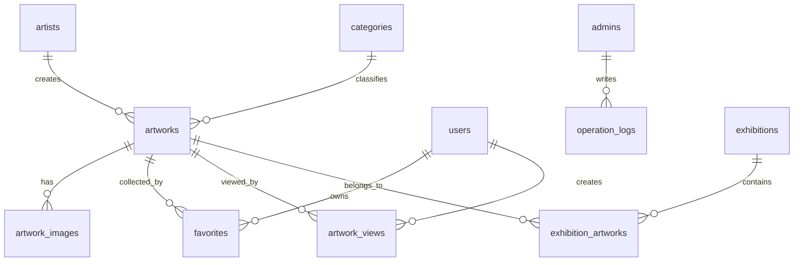

# 数据库 ERD 说明

本文档用于解释后端项目的核心数据库关系。当前代码中已经落地了 `artists`、`categories`、`artworks` 三张核心表，其他表会在后续业务迭代中逐步实现。

## 一、核心业务关系



## 二、已实现表

### artists 艺术家表

用途：保存艺术家基础资料。小程序艺术家详情页和作品详情页都会读取该表。

字段说明：

- `id`：艺术家主键。
- `name`：艺术家姓名，支持后台和小程序搜索。
- `avatar_url`：艺术家头像或肖像图片地址。
- `bio`：艺术家简介、履历、创作理念等长文本。
- `birth_year`：出生年份。
- `nationality`：国籍或地区。
- `status`：艺术家状态，建议使用 `active` 或 `hidden`。
- `created_at`：创建时间。
- `updated_at`：最后更新时间。

关系：

- 一个艺术家可以拥有多个作品。
- `artists.id` 被 `artworks.artist_id` 引用。

### categories 作品分类表

用途：保存作品分类，支持一级/二级分类树。

字段说明：

- `id`：分类主键。
- `name`：分类名称，例如油画、雕塑、摄影、综合材料。
- `parent_id`：父分类 ID。为空表示一级分类，不为空表示子分类。
- `sort_order`：排序权重，用于后台和小程序分类展示。
- `status`：分类状态，建议使用 `active` 或 `hidden`。
- `created_at`：创建时间。
- `updated_at`：最后更新时间。

关系：

- 一个分类可以包含多个作品。
- `categories.id` 被 `artworks.category_id` 引用。
- `categories.parent_id` 引用自身的 `categories.id`，用于分类树。

### artworks 艺术作品表

用途：保存作品核心信息，是后台上传和小程序展示的核心表。

字段说明：

- `id`：作品主键。
- `title`：作品标题。
- `subtitle`：作品副标题，可用于英文名、系列名或短说明。
- `artist_id`：艺术家 ID，关联 `artists.id`。
- `category_id`：分类 ID，关联 `categories.id`。
- `cover_url`：封面图地址，列表页优先展示。
- `description`：作品介绍。
- `material`：作品材质。
- `size_text`：作品尺寸，使用文本保存以兼容复杂表达。
- `creation_year`：创作年份。
- `status`：作品状态，建议使用 `draft`、`published`、`offline`。
- `is_featured`：是否首页推荐。
- `sort_order`：排序权重。
- `view_count`：浏览量冗余计数。
- `like_count`：点赞量冗余计数。
- `created_at`：创建时间。
- `updated_at`：最后更新时间。

关系：

- 多个作品可以属于同一个艺术家。
- 多个作品可以属于同一个分类。
- 一个作品后续可以有多张图片、多个收藏、多个浏览记录，也可以被多个展览专题引用。

## 三、后续计划表

### artwork_images 作品图片表

用途：保存作品详情页的多图信息。

建议字段：

- `id`
- `artwork_id`
- `image_url`
- `thumb_url`
- `sort_order`
- `created_at`

### admins 管理员表

用途：保存后台管理员账号和权限状态。

建议字段：

- `id`
- `username`
- `password_hash`
- `role`
- `status`
- `last_login_at`
- `created_at`
- `updated_at`

### users 小程序用户表

用途：保存微信小程序用户身份。

建议字段：

- `id`
- `openid`
- `nickname`
- `avatar_url`
- `status`
- `created_at`
- `updated_at`

### favorites 收藏表

用途：记录用户收藏作品关系。

建议字段：

- `id`
- `user_id`
- `artwork_id`
- `created_at`

约束：

- `user_id + artwork_id` 建议添加唯一约束，避免重复收藏。

### operation_logs 操作日志表

用途：记录后台管理员关键操作，便于审计和排查问题。

建议字段：

- `id`
- `admin_id`
- `action`
- `resource_type`
- `resource_id`
- `ip`
- `user_agent`
- `detail`
- `created_at`

## 四、状态枚举建议

```text
admin.status: active / disabled
user.status: active / disabled
artist.status: active / hidden
category.status: active / hidden
artwork.status: draft / published / offline
exhibition.status: draft / published / offline
```

## 五、查询规则建议

- 小程序公开接口只查询 `artworks.status = published` 的作品。
- 后台管理接口可以查询全部状态作品。
- 首页推荐作品查询 `artworks.is_featured = true`。
- 列表页优先使用分页，不一次性返回大量高清图片。
- 作品列表使用 `cover_url`，详情页再加载多图表 `artwork_images`。
